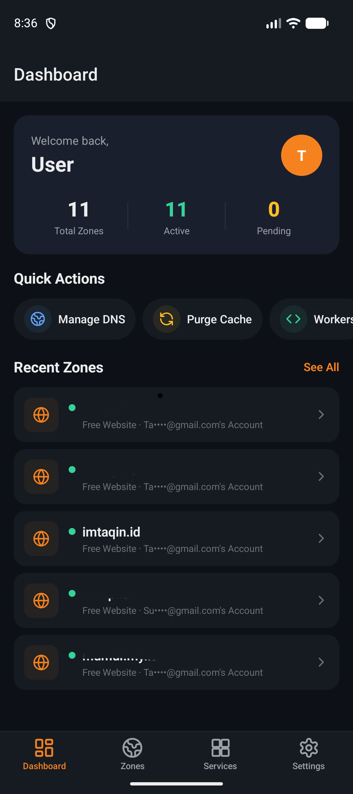
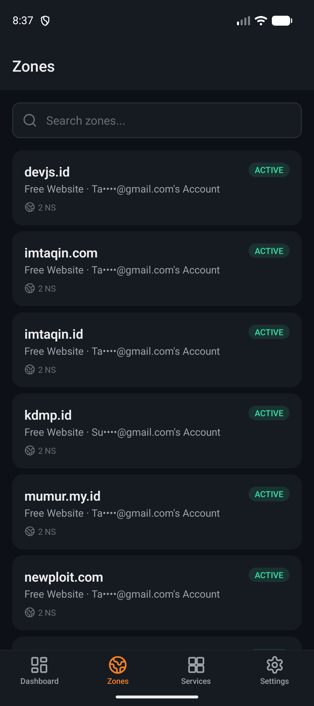
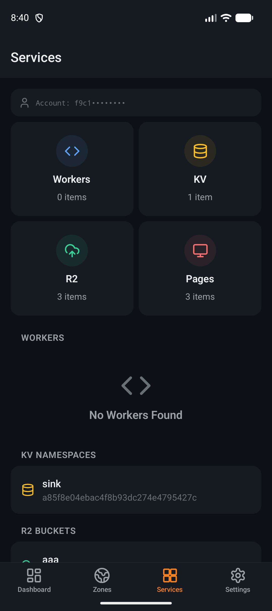
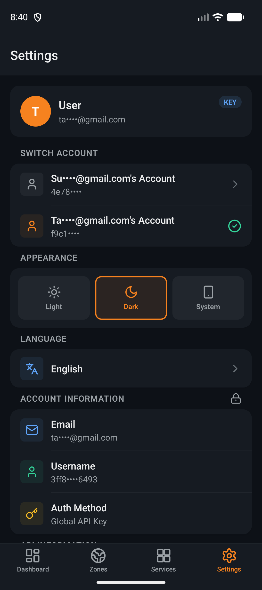
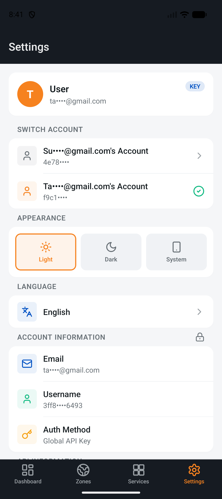

# CloudFlare Mobile

A full-featured Cloudflare management app built with React Native & Expo. Manage your domains, DNS records, Workers, KV, R2, Pages, and more — right from your phone.

> **Disclaimer:** This is an unofficial app and is not affiliated with, endorsed by, or officially connected to Cloudflare, Inc.

## Download

<a href="https://play.google.com/store/apps/details?id=id.imtaqin.cfmobile">
  
</a>

Available on [Google Play](https://play.google.com/store/apps/details?id=id.imtaqin.cfmobile), or grab the APK from [GitHub Releases](https://github.com/imtaqin/CFMobile/releases/latest).

## Screenshots

| Dashboard | Zones | Services |
|:---------:|:-----:|:--------:|
|  |  |  |

| Settings (Dark) | Settings (Light) |
|:---------------:|:----------------:|
|  |  |

## Features

- **Zone Management** — View and manage all your Cloudflare zones
- **DNS Records** — Create, edit, delete A, AAAA, CNAME, MX, TXT, and more
- **SSL/TLS** — Configure encryption mode, certificates, HTTPS settings
- **Firewall** — Manage firewall rules, IP access rules, rate limiting
- **Cache** — Purge cache, toggle development mode, cache settings
- **Analytics** — Traffic, bandwidth, and threats overview with time-series charts
- **Under Attack Mode** — One-tap security level toggle per zone
- **DNS Import/Export** — Bulk import & export records as BIND zone files
- **Email Routing** — Manage routing rules, catch-all, destination addresses
- **Audit Logs** — Account activity history viewer
- **Biometric Lock** — Fingerprint/face lock before the app opens
- **Workers** — View and manage Cloudflare Workers scripts
- **KV Namespaces** — Browse KV storage namespaces
- **R2 Buckets** — Manage R2 object storage with a built-in file browser (upload / download / delete)
- **Workers Live Logs** — Real-time tail of Worker requests and console output
- **Pages** — View Cloudflare Pages projects and deployments
- **Page Rules** — Configure page rules per zone
- **Multi-Account** — Switch between multiple Cloudflare accounts
- **Dark / Light Mode** — Manual theme toggle (Light, Dark, System)
- **Localization** — English and Bahasa Indonesia
- **Secure Storage** — API tokens stored with hardware-backed encryption (Android Keystore)
- **Privacy First** — Sensitive data (email, account IDs) masked by default

## How to Use

### 1. Get Your Cloudflare API Token

You need a Cloudflare API Token or Global API Key to use this app.

**API Token (Recommended):**
1. Login to [dash.cloudflare.com](https://dash.cloudflare.com)
2. Go to **My Profile > API Tokens**
3. Click **Create Token**
4. Use the **Edit zone DNS** template, or create a custom token with permissions you need:
   - `Zone:Read` — View zones
   - `Zone Settings:Read/Edit` — Manage zone settings (SSL, Cache, etc.)
   - `DNS:Read/Edit` — Manage DNS records
   - `Firewall Services:Read/Edit` — Manage firewall rules
   - `Analytics:Read` — View analytics
   - `Worker Scripts:Read/Edit` — Manage Workers
   - `Account Settings:Read` — View account info
5. Click **Continue to summary > Create Token**
6. Copy the token — you'll only see it once

**Global API Key (Not Recommended):**
1. Go to **My Profile > API Tokens**
2. Scroll down to **Global API Key**
3. Click **View** and copy the key
4. You'll also need your Cloudflare email address

> Global API Key has full access to your entire account. Use API Token with scoped permissions whenever possible.

### 2. Login

1. Open the app
2. Complete the onboarding (first time only)
3. Choose your auth method: **API Token** or **Global API Key**
4. Enter your credentials and tap **Sign In**
5. The app will verify your token and load your account

### 3. Navigate the App

| Tab | What You Can Do |
|-----|----------------|
| **Dashboard** | Overview of zones, stats, quick actions |
| **Zones** | Browse all zones, search, tap to manage |
| **Services** | Workers, KV, R2, Pages management |
| **Settings** | Theme, language, account info, sign out |

### 4. Managing a Zone

1. Tap any zone from **Dashboard** or **Zones** tab
2. You'll see zone info, nameservers, and management options:
   - **DNS Records** — Add/edit/delete records, toggle proxy
   - **SSL/TLS** — Change encryption mode (Off/Flexible/Full/Full Strict)
   - **Firewall** — View and manage firewall rules
   - **Cache** — Purge all cache, toggle dev mode
   - **Analytics** — View traffic and threat data
   - **Page Rules** — Configure URL-based rules
3. Toggle **Development Mode** directly from the zone detail page

### 5. Quick Actions

From the Dashboard, swipe the Quick Actions row to access:
- **Manage DNS** — Jump to zones list
- **Purge Cache** — Pick a zone and purge
- **Workers** — Go to services
- **Analytics** — Pick a zone and view stats
- **Firewall** — Pick a zone and manage rules
- **SSL/TLS** — Pick a zone and configure

### 6. Switch Account

If you have multiple Cloudflare accounts:
1. Go to **Settings**
2. Under **Switch Account**, tap the account you want
3. The app will reload with that account's data

### 7. Change Theme & Language

- **Theme:** Settings > Appearance > Light / Dark / System
- **Language:** Settings > Language > English / Bahasa Indonesia

## Auth Methods

| Method | Header | Security | Scope |
|--------|--------|----------|-------|
| **API Token** | `Authorization: Bearer <token>` | Scoped permissions | Recommended |
| **Global API Key** | `X-Auth-Email` + `X-Auth-Key` | Full account access | Not recommended |

Your credentials are stored locally on your device using **Android Keystore** (hardware-backed encryption). They are never sent to any server other than `api.cloudflare.com`.

## Getting Started (Development)

### Prerequisites

- Node.js 18+
- Android Studio with Android SDK
- JDK 17+
- A Cloudflare account

### Install

```bash
git clone https://github.com/imtaqin/CFMobile.git
cd CFMobile
npm install
```

### Run

```bash
# Start Expo dev server
npx expo start

# Run on Android emulator
npx expo run:android

# Run on Web
npx expo start --web
```

### Build Production AAB

```bash
# Generate native project
npx expo prebuild --platform android --clean

# Build release AAB
cd android && ./gradlew bundleRelease

# Output: android/app/build/outputs/bundle/release/app-release.aab
```

## Tech Stack

- **React Native** 0.81 + **Expo** 54
- **Expo Router** — File-based navigation
- **Expo Secure Store** — Encrypted credential storage
- **Axios** — HTTP client for Cloudflare API v4
- **i18next** — Internationalization (EN / ID)
- **react-native-svg** — Custom icon system (Lucide-based) & analytics charts
- **expo-local-authentication** — Biometric app lock
- **expo-document-picker / expo-sharing / expo-file-system** — DNS import/export & R2 file browser

## Project Structure

```
app/
  (tabs)/           # Tab screens (Dashboard, Zones, Services, Settings)
  zone/[id]/        # Zone detail pages (DNS, SSL, Firewall, Cache, Analytics, Page Rules)
  login.tsx         # Login screen
  onboarding.tsx    # First-time onboarding
components/ui/      # Reusable UI components (Card, Badge, Icon, MenuItem, etc.)
contexts/           # Auth & Theme providers
services/           # Cloudflare API client & TypeScript types
hooks/              # Custom React hooks
locales/            # i18n translation files (en.json, id.json)
constants/          # Theme colors, spacing, typography
```

## Known Limitations

- **Rate Limiting** — Cloudflare API allows 1,200 requests per 5 minutes. The app does not currently batch requests, so heavy usage may hit the limit.
- **No Offline Mode** — All data is fetched live from Cloudflare API. No local caching of zone data.
- **iOS** — Not tested on iOS. The app is built for Android first.
- **Workers Editor** — You can view Workers scripts but cannot edit code inline. Use the Cloudflare dashboard for code editing.
- **Two-Factor Auth** — The app does not handle 2FA. Use API Tokens which bypass 2FA.

## Privacy Policy

[https://imtaqin.id/page/-privacy-policy-cloudflare-mobile](https://imtaqin.id/page/-privacy-policy-cloudflare-mobile)

## License

MIT
